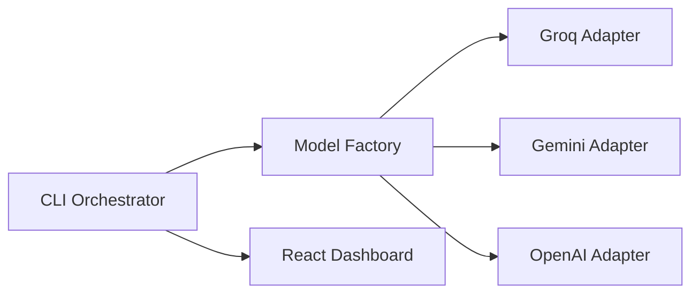

# 🤖 AiTestGen: Premium AI-Powered Test Generator

[](https://github.com/Sahilnaik1234/AiTestGen/actions)
[](https://opensource.org/licenses/MIT)
[](https://www.typescriptlang.org/)

**AiTestGen** is an enterprise-grade CLI tool that leverages state-of-the-art AI models (Groq, Gemini, OpenAI) to automatically generate high-coverage test suites for any programming language. It is designed to be plug-and-play, language-agnostic, and beautifully visualized.

---

## ⚡ Key Features

*   **Multi-Model Support**: Seamlessly swap between **Groq (Llama 3)**, **Google Gemini**, and **OpenAI (GPT-4)**.
*   **Polyglot Logic**: Native support for **TypeScript**, **JavaScript**, **Go**, **Python**, and **Java**.
*   **CI/CD Native**: Automatic coverage enforcement (70% threshold) integrated with GitHub Actions.
*   **High-Fidelity Dashboard**: A premium React-based glassmorphism dashboard to visualize your test artifacts and coverage.
*   **Smart Prompting**: Context-aware prompts that handle language-specific quirks (like JS Date objects or JUnit 5 naming conventions).

---

## 🚀 Quick Start

### 1. Installation
```bash
git clone https://github.com/Sahilnaik1234/AiTestGen.git
cd AiTestGen
npm install
```

### 2. Configuration
Create a `.env` file in the root:
```env
GROQ_API_KEY=your_key_here
GEMINI_API_KEY=your_key_here
OPENAI_API_KEY=your_key_here
```

### 3. Generate Tests
```bash
# Generate tests for all files in the examples folder using Groq
npm start -- generate "examples/**/*.*" --model groq
```

---

## 📊 High-Fidelity Dashboard

We don't just generate text; we provide an experience. Our built-in dashboard allows you to review AI artifacts side-by-side with your source code.

### Running Locally:
```bash
cd dashboard
npm install
npm run dev
```

### Live Demo:
The dashboard is automatically deployed via GitHub Actions to:
[https://Sahilnaik1234.github.io/AiTestGen/](https://Sahilnaik1234.github.io/AiTestGen/)

---

## 🛡️ Built-in Quality Guardrails

The pipeline automatically runs coverage checks for every generated test:
*   **TypeScript/JS**: Jest
*   **Go**: `go test -cover`
*   **Python**: `pytest-cov`
*   **Java**: Maven + JaCoCo

All checks must pass a **70% coverage threshold** to maintain project health.

---

## 🛠️ Architecture

Built with a modular **Adapter Pattern**, making it trivially easy to add new AI providers or programming languages.



---